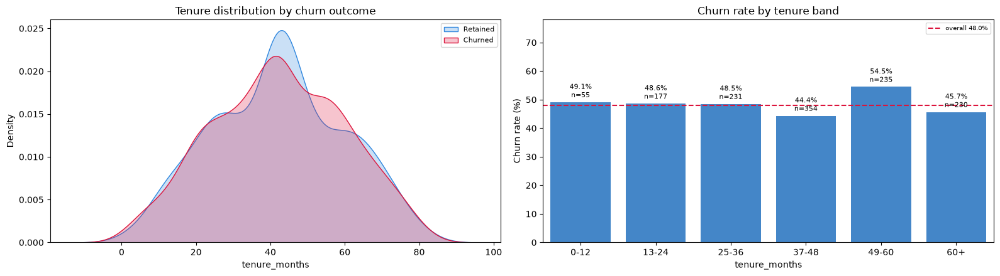
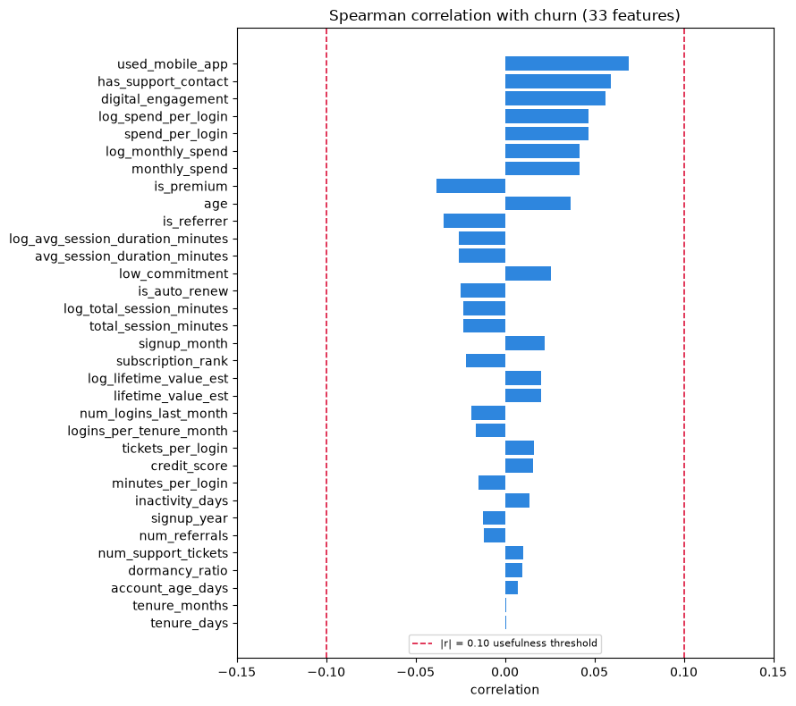
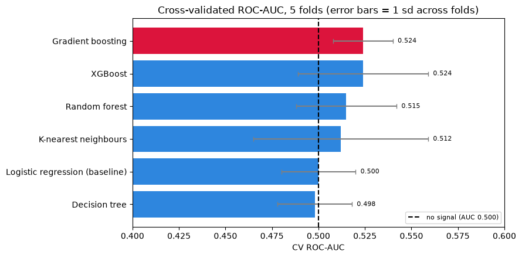
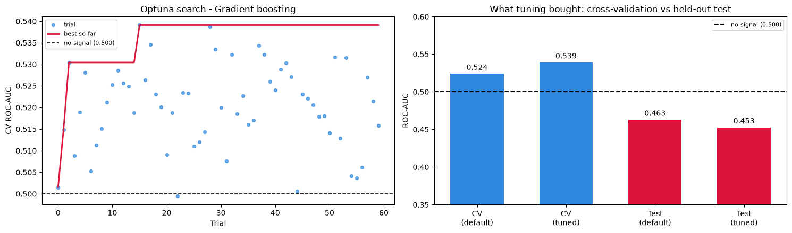
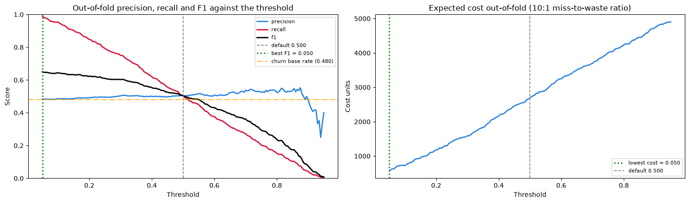
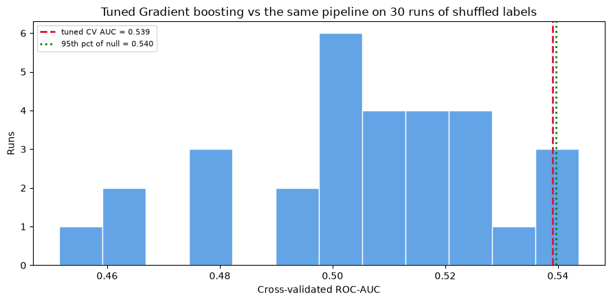

# Customer Churn Analysis

An end-to-end machine learning assessment of customer churn for an e-commerce subscription business. The project covers data-quality assessment, exploratory analysis, feature engineering, model comparison, hyperparameter tuning, threshold analysis, statistical validation, model interpretation, and business recommendations.

## Executive conclusion

**Do not deploy a churn model trained on this dataset.**

The analysis tested six model families using identical preprocessing and stratified cross-validation. Their mean cross-validated ROC-AUC scores ranged from **0.498 to 0.524**, effectively the same as random ranking at 0.500. Optuna tuning raised the selected model's cross-validated ROC-AUC to 0.539, but its held-out test ROC-AUC fell from 0.463 to 0.453. A label-shuffle test also found that the tuned score could not be distinguished from scores obtained with random labels (empirical p-value 0.067).

The result is a data finding rather than a failed modeling exercise: the available customer attributes do not contain a reliable relationship with churn. Deploying the model would create a high-risk list that is effectively a random sample of customers.

## Key visual evidence

The following charts are direct outputs from `churn.ipynb` and summarize the evidence behind the deployment recommendation.

### Tenure does not separate churned and retained customers

The tenure distributions nearly overlap, and churn rates do not move consistently across tenure bands. Mean tenure is 42.10 months for retained customers and 42.15 months for churned customers.



### No feature reaches a useful correlation with churn

None of the 33 numeric inputs reaches the reference threshold of an absolute 0.10 correlation. The strongest observed relationship is only 0.069 for `used_mobile_app`.



### All six model families perform near chance

Mean cross-validated ROC-AUC ranges from 0.498 to 0.524. The uncertainty across folds is larger than the difference between the best and worst model.



### Hyperparameter tuning fits validation noise

Optuna increases cross-validated ROC-AUC from 0.524 to 0.539, while held-out test ROC-AUC decreases from 0.463 to 0.453. The opposing movement indicates that tuning does not improve generalization.



### Threshold optimization behaves like contacting everyone

Both F1 optimization and the illustrative 10:1 miss-to-waste cost ratio select a threshold of 0.05. This flags approximately 98% of customers while precision remains near the 48% churn base rate.



### The tuned model does not beat shuffled labels

The tuned model's cross-validated ROC-AUC of 0.539 remains below the shuffled-label 95th percentile of 0.540. Its empirical p-value is 0.067.



## Business objective

The project addresses three questions:

1. What behavior distinguishes customers who churn from customers who remain?
2. Can the available customer data identify users at risk of churn?
3. What actions should Product and Marketing take based on the evidence?

The notebook deliberately evaluates whether a model is fit for use, rather than treating model deployment as a required outcome.

## Repository contents

| File | Description |
|---|---|
| `churn.ipynb` | Complete analysis, modeling pipeline, diagnostics, charts, and interpretation. |
| `CHURN_DATASET.xlsx` | Source workbook containing the assessment brief, data dictionary, and 1,500 customer records. |
| `PART B.docx` | Executive summary with key results, supporting charts, business recommendations, limitations, and next steps. |

## Dataset

The source workbook contains three sheets:

- `Challenge`: business scenario, objectives, and requested deliverables.
- `Columns Description`: definitions for the 15 source fields.
- `churn_dataset`: 1,500 customer-level records.

### Source fields

| Field | Meaning |
|---|---|
| `customer_id` | Unique customer identifier. |
| `age` | Customer age in years. |
| `gender` | Male, Female, or Other. |
| `subscription_type` | Free, Basic, or Premium. |
| `signup_date` | Customer signup timestamp. |
| `last_active_date` | Most recent activity timestamp. |
| `monthly_spend` | Monthly customer spend in dollars. |
| `num_logins_last_month` | Logins during the previous month. |
| `num_support_tickets` | Number of submitted support tickets. |
| `is_auto_renew` | Whether automatic renewal is enabled. |
| `used_mobile_app` | Whether the customer used the mobile app. |
| `num_referrals` | Number of referred users. |
| `avg_session_duration_minutes` | Average session duration in minutes. |
| `credit_score` | Customer credit score. |
| `churned` | Target: 1 for churned and 0 for retained. |

All 15 columns contain missing values in the raw data. Missingness ranges from 82 rows for `credit_score` to 118 rows for `num_referrals`. The target is missing in 114 raw records.

## Analysis workflow

### 1. Data-quality assessment and cleaning

The notebook:

- checks dimensions, data types, missingness, and duplicate rows;
- reconstructs missing customer IDs from the sequential ID pattern and verifies uniqueness;
- identifies repeated and impossible extreme values in `monthly_spend`, `avg_session_duration_minutes`, and `credit_score`;
- removes 112 corrupted rows before calculating imputation statistics;
- retains 1,388 of the original 1,500 rows;
- fills numeric gaps with mean or median values according to each variable's distribution;
- reconstructs missing dates using observed tenure information;
- fills three categorical or binary features using fixed-seed sampling from their observed distributions, limiting distribution drift to 0.3 percentage points; and
- does not impute the target variable.

After cleaning, 106 records without a churn label are separated for possible future scoring. Modeling uses the remaining **1,282 labelled customers**.

### 2. Exploratory data analysis

The churn target is nearly balanced:

- churned: 48.0%;
- retained: 52.0%; and
- majority-class accuracy baseline: 52.0%.

The exploratory analysis examines target balance, categorical churn rates, age and subscription mix, tenure, numeric feature distributions, effect sizes, significance tests, and Spearman correlations.

No source feature provides useful separation:

- the strongest categorical association is `used_mobile_app`, with Cramer's V of 0.068;
- the strongest numeric or binary correlation with churn is 0.069;
- the largest standardized mean difference is 0.087 for `monthly_spend`; and
- retained and churned customers have nearly identical mean tenure: 42.10 versus 42.15 months (Mann-Whitney p-value 0.980).

### 3. Feature engineering

The notebook uses a fixed snapshot date of `2025-01-01` and creates 23 additional features, including:

- inactivity, account age, tenure, and dormancy measures;
- signup year and month;
- spend per login and minutes per login;
- total session minutes and logins per tenure month;
- tickets per login and support-contact indicators;
- estimated lifetime value;
- referral, subscription, premium, engagement, and commitment indicators; and
- log-transformed versions of skewed spending and usage measures.

The final modeling frame contains 36 model features. None of the 33 numeric inputs reaches an absolute correlation of 0.10 with churn.

### 4. Model comparison

The analysis uses a stratified 80/20 train-test split:

- training set: 1,025 customers;
- held-out test set: 257 customers; and
- model selection: stratified 5-fold cross-validation on the training set.

All models use consistent preprocessing. Numeric variables are scaled where appropriate, and categorical variables are one-hot encoded.

| Model | Mean CV ROC-AUC | Test ROC-AUC | Test F1 |
|---|---:|---:|---:|
| Gradient boosting | 0.524 | 0.463 | 0.454 |
| XGBoost | 0.524 | 0.451 | 0.430 |
| Random forest | 0.515 | 0.445 | 0.400 |
| K-nearest neighbours | 0.512 | 0.533 | 0.543 |
| Logistic regression | 0.500 | 0.471 | 0.366 |
| Decision tree | 0.498 | 0.506 | 0.375 |

The narrow 0.026 spread between the best and worst cross-validated models is smaller than the fold-to-fold variation observed within individual models. The cross-validation and test rankings also disagree, which is consistent with unstable noise rather than a generalizable pattern.

### 5. Hyperparameter tuning

Gradient boosting is selected because it has the highest mean cross-validated score, tied with XGBoost. Optuna runs 60 Bayesian optimization trials.

| Version | CV ROC-AUC | Test ROC-AUC | Test F1 |
|---|---:|---:|---:|
| Default gradient boosting | 0.524 | 0.463 | 0.454 |
| Tuned gradient boosting | 0.539 | 0.453 | 0.430 |

The improvement appears only in the folds used by the search. Performance declines on unseen test data, indicating that tuning selected fold-specific noise rather than a stronger predictive relationship.

### 6. Decision-threshold analysis

Threshold selection uses out-of-fold training predictions, keeping the held-out test set untouched. The notebook evaluates both maximum F1 and an illustrative cost function in which a missed churner costs ten times as much as an unnecessary retention contact.

Both objectives choose a threshold of 0.05, which flags approximately 98% of customers. Test F1 becomes 0.651, but contacting every customer without a model already produces F1 of 0.647. The model therefore adds only 0.003 of F1 while behaving like a contact-everyone rule. The notebook retains 0.50 as the reporting threshold and does not recommend operational use.

### 7. Label-shuffle validation

The tuned pipeline is retrained 30 times after randomly permuting the churn labels. This produces the score distribution expected when no relationship exists.

- shuffled-label mean ROC-AUC: 0.505;
- shuffled-label standard deviation: 0.023;
- shuffled-label 95th percentile: 0.540;
- tuned model cross-validated ROC-AUC: 0.539; and
- empirical p-value: 0.067.

The tuned model does not clear the shuffled-label benchmark. This supports the conclusion that the weak result comes from the data rather than a missing model class or an implementation error.

### 8. Model interpretation

The project compares three interpretation methods:

- logistic-regression coefficients and odds ratios;
- permutation importance on the held-out test set; and
- SHAP values for the tuned model.

The methods disagree on the most important features. Spearman rank agreement between the logistic coefficient and SHAP rankings is only 0.212. The largest permutation importance is a ROC-AUC decrease of 0.0146, and only 4 of 36 features have a mean importance greater than their own variability. These rankings should not be converted into customer targeting rules because the underlying model has not demonstrated predictive skill.

## Main findings

1. **The supplied predictors contain no usable churn signal.** Raw and engineered features have negligible associations with the target.
2. **Model complexity does not improve the result.** Linear, tree-based, distance-based, bagging, and boosting methods all perform near chance.
3. **Hyperparameter tuning overfits the validation folds.** Cross-validation improves while held-out performance declines.
4. **Threshold optimization cannot create ranking power.** The apparent F1 gain comes from contacting almost everyone.
5. **The final model is statistically indistinguishable from the same pipeline trained on random labels.**
6. **Feature-importance charts are not actionable when the model itself has no validated signal.**

## Business recommendations

### Do not use the scores for a retention campaign

A high-risk list produced by this model would be approximately random. Campaign spend based on it would not be defensible, and the model could create false confidence in ineffective targeting.

### Define and instrument the churn event

Adopt an operational definition such as an explicit cancellation or no purchase for 90 days. Record the event date and, when available, the reason for churn. A single undated binary flag prevents time-aware modeling and leakage checks.

### Collect longitudinal behavior

Replace the single customer snapshot with event-level histories for sessions, orders, payments, and support interactions. Six to twelve months of history would allow trend features such as declining spend, falling login frequency, or increasing support friction.

### Add commercial and service-friction variables

Priority fields include failed payments, refunds, delivery problems, ticket resolution time, support sentiment, discount exposure, campaign history, and price changes.

### Use transparent rules until reliable training data exists

Operational triggers such as a failed payment, a ticket exceeding its service-level target, or a defined inactivity period are auditable and do not pretend to provide predictive ranking.

### Re-run the validation gate before deployment

Once improved data is available, re-run the notebook and require the real cross-validated score to clear the shuffled-label distribution before considering deployment.

## Limitations

- The analysis has 1,282 labelled customers after cleaning, so weak genuine effects may be undetectable at this sample size.
- The data is a single snapshot and cannot represent behavioral changes over time.
- Nine feature columns require imputation after corrupted rows are removed.
- The target has no event timestamp or reason code.
- Repeated identical extreme values, flat tenure behavior, and uniform categorical patterns suggest that the dataset may be synthetic. This should be confirmed before interpreting the findings as customer behavior.
- No production model or customer scoring file is delivered because the analysis does not support deployment.

## How to run the analysis

1. Clone the repository and enter its directory.
2. Create and activate a Python virtual environment.
3. Install the required packages:

```bash
pip install jupyter pandas numpy scipy matplotlib seaborn scikit-learn xgboost optuna shap openpyxl
```

4. Start Jupyter:

```bash
jupyter notebook
```

5. Open `churn.ipynb` and run the cells from top to bottom. Keep `CHURN_DATASET.xlsx` in the repository root because the notebook reads it with a relative path.

The notebook uses fixed random seeds for the train-test split, cross-validation, imputations, model initialization, and shuffle tests where supported. The generated charts and stored outputs document the reported run.

## Evaluation principles

This project treats validation as a deployment decision, not just a score-reporting exercise:

- ROC-AUC is the primary ranking metric because the classes are close to balanced and threshold choice is handled separately.
- Precision, recall, F1, PR-AUC, and the confusion matrix provide supporting views.
- Cross-validation is used for model comparison and hyperparameter selection.
- The held-out test set is reserved for final generalization checks.
- Out-of-fold predictions are used for threshold selection.
- A label-shuffle test measures whether the selected model beats performance obtainable from random targets.
- Business recommendations follow the validated evidence, including the possibility that no model should be deployed.

## Intended use

This repository is an analytical assessment and portfolio project. It is suitable for reviewing the data-science workflow, statistical reasoning, and communication of a negative model result. It is not a production churn-scoring system, and its model outputs should not be used to make customer-level decisions.
